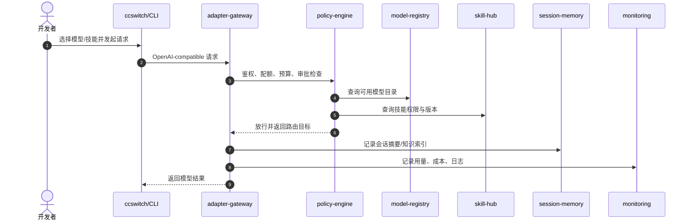
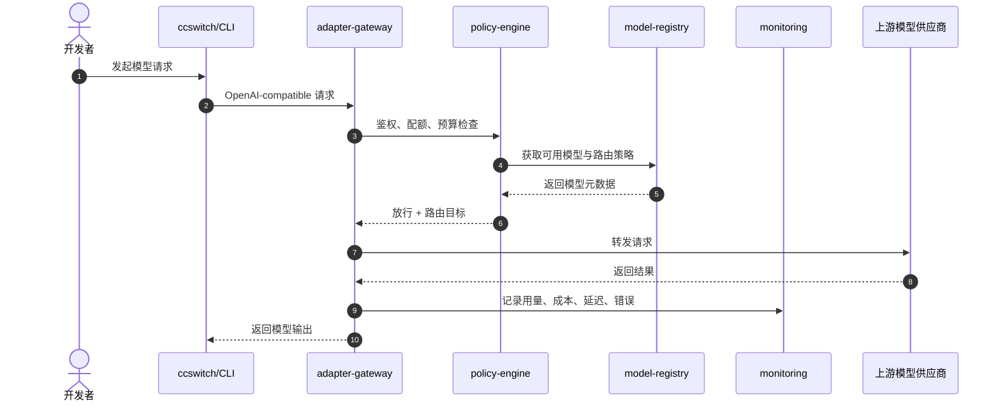
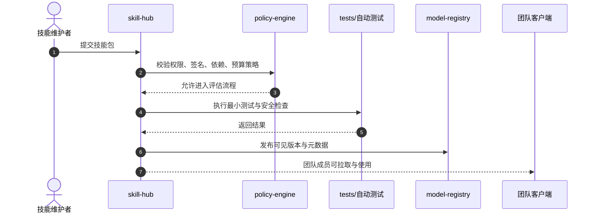
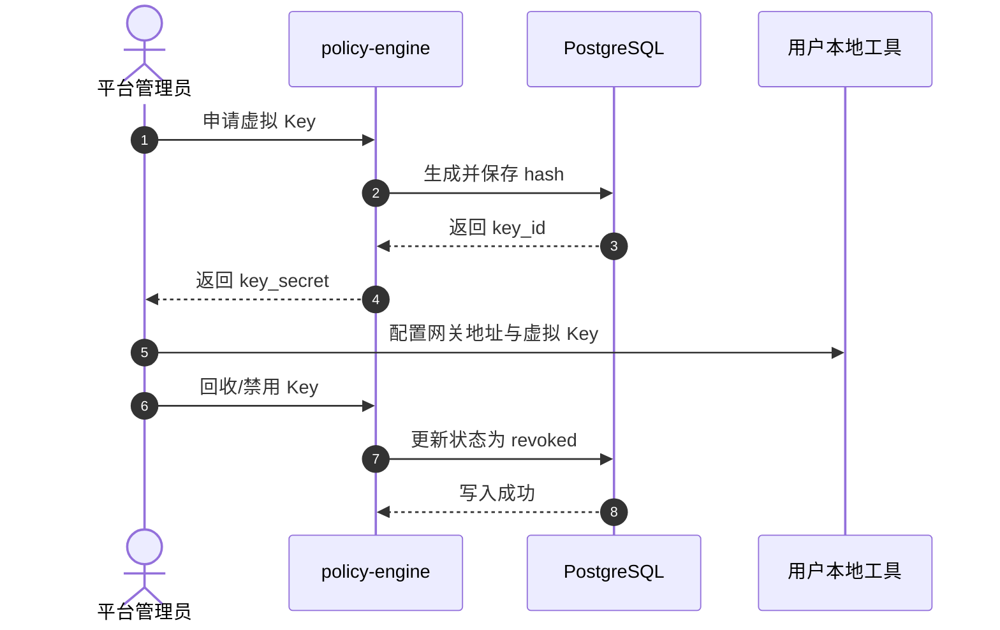

# Aegis Nexus AI Platform 完整方案（最新版）

> 统一模型接入、Key 治理、技能共享、会话记忆、协同编排的团队 AI 后端方案。保留 ccswitch 作为用户侧 CLI/入口，平台侧自研后端控制面。

## 1. 项目定位

Aegis Nexus AI Platform 面向团队内部 AI 协作场景，提供统一的模型接入层、Key 治理层、技能中心、会话/记忆层和协同编排层。用户侧继续使用 ccswitch、Claude Code、Codex、OpenCode 等本地工具，后端则由平台统一控制模型、权限、成本、技能与会话。

## 2. 总体架构

### 2.1 分层结构

- 用户侧入口：ccswitch / Claude Code / Codex / OpenCode / 其他 OpenAI-compatible 客户端
- 协议适配层：adapter-gateway
- 策略治理层：policy-engine
- 能力目录层：model-registry
- 技能治理层：skill-hub
- 会话记忆层：session-memory
- 协同工作流层：workflow-engine
- 观测监控层：monitoring

### 2.2 请求流

1. 用户在本地工具中配置统一网关地址。
2. 请求进入 adapter-gateway，完成协议兼容与参数归一化。
3. policy-engine 执行 Key、权限、预算、审批与审计判断。
4. model-registry 提供模型路由目标与能力元数据。
5. skill-hub 提供技能包、版本和权限控制。
6. session-memory 和 Qdrant 支撑会话、知识与 RAG。
7. workflow-engine 处理多 Agent 协同、审批和高风险操作。
8. monitoring 记录用量、成本、日志、告警和健康状态。

## 3. 核心能力

### 3.1 统一模型目录

平台集中维护模型目录，向本地工具暴露可见模型列表、能力标签、上下文长度、成本等级、可用性和健康状态。

### 3.2 统一 Key 治理

平台统一颁发、回收和审计虚拟 Key，避免本地分散配置上游原始密钥。

### 3.3 技能中心

技能以版本化包形式管理，支持发布、签名、依赖、灰度、回滚和团队共享。

### 3.4 会话与记忆

平台保存会话摘要、上下文索引和知识向量，支持后续 RAG、会话恢复和组织知识沉淀。

### 3.5 协同编排

通过 supervisor/specialist 多 Agent 架构支撑分析、编码、评审、测试、文档和发布等协作流程。

## 4. 接口协议

### 4.1 模型目录 API

- `GET /api/models`
- `POST /api/models/register`
- `GET /api/models/{id}`
- `PATCH /api/models/{id}`

返回字段包括：provider、name、endpoint、context_window、cost_tier、tags、labels、status、quota。

### 4.2 Key 管理 API

- `POST /api/keys/issue`
- `GET /api/keys`
- `DELETE /api/keys/{id}`

用于发放、查询和回收虚拟 Key。

### 4.3 技能包 API

- `GET /api/skills`
- `POST /api/skills/publish`
- `GET /api/skills/{id}`
- `POST /api/skills/{id}/rollback`

技能包建议包含 skill.yaml、policy.json 和 tests/。

### 4.4 会话 API

- `GET /api/sessions`
- `GET /api/sessions/{id}`
- `POST /api/sessions`
- `PATCH /api/sessions/{id}`

支持按用户、项目、时间过滤。

### 4.5 策略与审批 API

- `GET /api/policies`
- `POST /api/policies`
- `POST /api/approvals/submit`
- `GET /api/approvals/{id}`

用于 RBAC、ABAC、预算、审批和高风险操作控制。

## 5. 数据库结构

### 5.1 model_registry

- id
- provider
- name
- endpoint
- context_window
- cost_tier
- tags jsonb
- labels jsonb
- status
- quota
- created_at
- updated_at

### 5.2 access_key

- id
- key_hash
- user_id
- project_id
- scope
- expire_at
- quota
- status
- created_at
- updated_at

### 5.3 skill_package

- id
- name
- version
- owner_id
- metadata jsonb
- policy jsonb
- dependencies jsonb
- signature
- status
- created_at
- updated_at

### 5.4 session

- id
- user_id
- project_id
- title
- summary
- memory_vector_id
- status
- created_at
- updated_at

### 5.5 policy

- id
- name
- type
- rules jsonb
- status
- created_at
- updated_at

### 5.6 approval

- id
- applicant_id
- action
- resource_id
- status
- approver_id
- reason
- created_at
- updated_at

## 6. 模块拆分

- adapter-gateway：协议适配、参数归一化、统一入口
- policy-engine：Key、权限、预算、审批、审计
- model-registry：模型注册、能力元数据、健康、成本、可用性
- skill-hub：技能包、版本、权限、依赖、灰度、回滚、签名
- session-memory：会话、项目、组织知识、RAG 向量索引
- workflow-engine：协同工作流、DAG、状态机、人工审批
- monitoring：用量、成本、日志、告警、健康监控

## 7. 模块依赖关系

```text
ccswitch/CLI/Client
  -> adapter-gateway
  -> policy-engine
  -> model-registry
  -> skill-hub
  -> session-memory
  -> workflow-engine
  -> monitoring
```

### 7.1 依赖说明

- 用户所有请求统一进入 adapter-gateway。
- policy-engine 决定是否放行和路由。
- model-registry、skill-hub 和 session-memory 提供业务能力目录。
- workflow-engine 控制协作流程和审批。
- monitoring 记录所有关键指标。

## 8. 阶段规划

### 8.1 Phase 1：MVP

- LiteLLM 统一网关
- Open WebUI / ccswitch 用户入口
- Qdrant 向量库
- 虚拟 Key 生成与回收
- 一键启动与健康检查

### 8.2 Phase 2：治理与能力中心

- adapter-gateway
- model-registry
- policy-engine
- skill-hub
- session-memory
- workflow-engine
- monitoring
- ccswitch/CLI 端到端集成测试

### 8.3 Phase 3：Agent 协同与产品化

- 多 Agent 编排内核
- 角色模板与协作流程
- 评测闭环与失败样本回流
- Skill/Prompt/Agent GitOps
- 质量、用量、效率看板
- 组织知识资产沉淀与复用

## 9. 90 天落地计划

### 第 1-2 周

- 完成 adapter-gateway、model-registry、policy-engine 基础接口
- 完成数据库初始化与迁移脚本
- 完成 LiteLLM/ccswitch 端到端验证

### 第 3-4 周

- 完成 skill-hub、session-memory、workflow-engine 基础能力
- 完成 RBAC、ABAC、审批流、用量统计、监控接入
- 完成集成测试用例

### 第 2 个月

- 上线团队级模型、技能、会话、审批、用量、成本治理
- 支持多团队、多项目、多租户隔离
- 上线灰度、回滚、签名校验、依赖管理
- 完善运维和文档

### 第 3 个月

- 上线多 Agent 协同内核
- 上线评测闭环和 A/B 测试
- 上线组织知识资产沉淀与复用
- 产品化交付与推广

## 10. 风险与应对

- 风险：上游组件能力变化
  - 应对：核心协议和控制面自研，业务不直接依赖上游内部接口
- 风险：多客户端兼容差异
  - 应对：统一 OpenAI-compatible 兼容层和契约测试
- 风险：Key 治理不完整
  - 应对：短期令牌、权限分级、审计和回收机制
- 风险：技能包治理复杂
  - 应对：版本化、签名、灰度、回滚和 GitOps 发布流

## 11. 当前状态

- Phase 1：已完成
- Phase 2：设计与任务拆分已完成
- Phase 3：规划已完成，待实现

## 12. 建议保留的主入口

- README.md：项目入口与快速开始
- TEAM_AI_PLATFORM_FULL_VERSION.md：唯一完整版方案

## 13. 用户画像与核心场景

### 13.1 用户画像

- 平台管理员：负责模型接入、Key 发放、审计、回收和治理策略配置
- 团队负责人：负责团队配额、技能发布审批、可用模型范围控制
- 普通开发者：通过 ccswitch/CLI 使用统一模型、技能和会话能力
- 审计/安全人员：查看调用日志、成本、异常请求与审批记录

### 13.2 核心场景

- 场景 A：开发者使用 ccswitch 连接平台统一网关，直接选择可用模型
- 场景 B：团队负责人发布一个 Skill 包，团队成员可以在本地工具中直接使用
- 场景 C：管理员回收某个用户的虚拟 Key，后续请求立即失效
- 场景 D：某个模型故障时，平台自动切换备用模型并记录告警
- 场景 E：高风险操作需要审批后才能执行，例如生产变更或数据库迁移

## 14. 端到端业务流程



### 14.1 Key 发放与回收流程

1. 管理员在后台创建用户/项目/团队范围的虚拟 Key。
2. 平台下发 hash 化后的访问凭证，不暴露上游原始密钥。
3. 用户在本地工具中配置统一网关地址与虚拟 Key。
4. 管理员随时可回收 Key，回收后立即失效。

### 14.2 技能发布与使用流程

1. 维护者提交 Skill 包，包含 skill.yaml、policy.json、tests/。
2. 平台执行签名校验、依赖检查和最小测试。
3. 通过后进入 dev/stage/prod 生命周期。
4. 本地工具按团队/项目拉取可用技能并加载。

## 15. 角色权限矩阵

| 角色 | 模型接入 | Key 发放 | Key 回收 | 技能发布 | 技能回滚 | 审批查看 | 审计查看 |
| --- | --- | --- | --- | --- | --- | --- | --- |
| 平台管理员 | 是 | 是 | 是 | 是 | 是 | 是 | 是 |
| 团队负责人 | 部分 | 否 | 否 | 是 | 是 | 是 | 部分 |
| 普通开发者 | 是 | 仅自用 | 仅自用 | 否 | 否 | 否 | 否 |
| 审计/安全人员 | 否 | 否 | 否 | 否 | 否 | 是 | 是 |

## 16. 部署拓扑与运行边界

### 16.1 推荐部署

- 用户侧：ccswitch / Claude Code / Codex / OpenCode
- 控制面：adapter-gateway、policy-engine、model-registry、skill-hub、workflow-engine
- 数据面：PostgreSQL、Qdrant、对象存储（Skill 包/归档）
- 观测面：Prometheus、Grafana、Langfuse、OpenTelemetry Collector

### 16.2 运行约束

- 所有本地工具只对接统一 OpenAI-compatible 网关。
- 上游供应商 Key 不直接分发给终端用户。
- 所有调用必须进入审计链路。
- 技能包与模型目录均以版本化方式发布。

## 17. 接口契约草案

### 17.1 GET /api/models

Response fields:

- id
- provider
- name
- endpoint
- context_window
- cost_tier
- availability
- tags
- labels

### 17.2 POST /api/keys/issue

Request fields:

- user_id
- project_id
- scope
- expire_at
- quota

Response fields:

- key_id
- key_secret
- status

### 17.3 POST /api/skills/publish

Request fields:

- package_name
- version
- skill_yaml
- policy_json
- tests_archive

Response fields:

- skill_id
- version
- lifecycle_status

### 17.4 POST /api/approvals/submit

Request fields:

- applicant_id
- action
- resource_id
- reason

Response fields:

- approval_id
- status
- approver_id

## 18. 非功能性要求

- 可用性：核心控制面支持高可用部署，避免单点故障
- 可观测性：请求、成本、错误、审批与回收事件全量记录
- 可扩展性：模型、技能、会话、工作流均支持水平扩展
- 安全性：Key 可回收、权限可分级、调用可审计、敏感信息不落本地明文
- 可替换性：上游模型路由和入口工具可替换，不锁死单一厂商

## 19. MVP 验收标准

- 用户能通过 ccswitch 或其他 OpenAI-compatible 客户端接入统一网关
- 用户无需在本地保存上游厂商原始 Key
- 管理员能发放、查询、回收虚拟 Key
- 平台能返回统一模型目录并记录调用日志与成本
- 技能包可以发布、回滚并在团队内复用
- 会话和知识索引可被后续 RAG/Agent 直接使用

## 20. 开发落地优先级

### P0

- 统一网关与 Key 治理
- 模型目录
- 基础审计与成本统计

### P1

- 技能中心
- 会话记忆
- 权限与审批

### P2

- 多 Agent 编排
- 评测闭环
- 组织知识资产沉淀

## 21. 关键时序图

### 21.1 统一模型调用时序



### 21.2 技能发布时序



### 21.3 虚拟 Key 发放与回收时序



## 22. 接口契约细则

### 22.1 统一鉴权方式

- 请求头使用 `Authorization: Bearer <virtual_key>`
- 管理类接口增加管理员会话或后端服务身份认证
- 所有写操作必须携带幂等键或业务唯一标识，避免重复提交

### 22.2 通用错误码

- `401 Unauthorized`：Key 缺失或无效
- `403 Forbidden`：权限不足或策略拒绝
- `404 Not Found`：资源不存在
- `409 Conflict`：版本冲突、重复发布、状态不允许
- `429 Too Many Requests`：配额或频率限制触发
- `500 Internal Server Error`：网关或后端内部异常

### 22.3 模型目录响应示例

```json
{
  "id": "gpt-4o",
  "provider": "openai",
  "name": "GPT-4o",
  "endpoint": "https://api.openai.com/v1/chat/completions",
  "context_window": 128000,
  "cost_tier": "high",
  "availability": "active",
  "tags": ["chat", "code"],
  "labels": {"team": "platform"}
}
```

### 22.4 虚拟 Key 发放响应示例

```json
{
  "key_id": "key_01H...",
  "key_secret": "sk-virtual-xxxx",
  "status": "active",
  "expire_at": "2026-12-31T23:59:59Z"
}
```

### 22.5 技能发布请求示例

```json
{
  "package_name": "code-security-scan",
  "version": "1.0.0",
  "skill_yaml": "...",
  "policy_json": "...",
  "tests_archive": "..."
}
```

## 23. 数据库约束与索引建议

### 23.1 唯一约束

- `model_registry(provider, name)` 唯一
- `skill_package(name, version)` 唯一
- `access_key(key_hash)` 唯一
- `policy(name, type)` 唯一

### 23.2 索引建议

- `access_key(user_id, project_id, status)`
- `model_registry(status, cost_tier)`
- `skill_package(status, owner_id)`
- `session(user_id, project_id, created_at desc)`
- `approval(status, created_at desc)`

### 23.3 审计字段约定

- 所有业务表必须包含 `created_at` 与 `updated_at`
- 重要生命周期字段必须使用枚举状态值
- 关键变更建议增加 `created_by`、`updated_by`、`revoked_at`、`revoked_by`

## 24. 按周执行计划

### 第 1 周

- 明确模块边界和仓库结构
- 定义 API 契约草案
- 确定数据库表和唯一约束

### 第 2 周

- 完成 adapter-gateway 与 policy-engine 雏形
- 完成虚拟 Key 发放/回收最小链路
- 完成模型目录读取接口

### 第 3 周

- 完成 model-registry 与 skill-hub 基础实现
- 完成技能发布最小流程
- 完成基本审计日志落库

### 第 4 周

- 完成 session-memory 与 Qdrant 接入
- 完成用量、成本与错误监控
- 完成端到端集成测试

### 第 5 周

- 完成审批流与高风险操作闸门
- 完成团队级权限矩阵落地
- 完成文档与运维手册补充

### 第 6 周

- 完成 Phase 2 联调
- 组织试点团队验证 ccswitch 接入
- 收集反馈并修正契约与流程

## 25. 交付清单

- README 入口说明
- 唯一完整版方案
- 接口契约草案
- 数据库结构与约束建议
- 时序图与流程图
- 按周执行计划
- MVP 验收标准

## 26. 代码级目录结构建议

```text
team_ai_platform/
├── README.md
├── TEAM_AI_PLATFORM_FULL_VERSION.md
├── docker-compose.yml
├── litellm/
│   └── config.yaml
├── scripts/
│   ├── start.sh
│   ├── healthcheck.sh
│   └── bootstrap_virtual_key.sh
└── backend/
  ├── adapter-gateway/
  │   ├── app/
  │   ├── routers/
  │   ├── services/
  │   └── tests/
  ├── policy-engine/
  │   ├── app/
  │   ├── models/
  │   ├── services/
  │   └── tests/
  ├── model-registry/
  │   ├── app/
  │   ├── repositories/
  │   ├── services/
  │   └── tests/
  ├── skill-hub/
  │   ├── app/
  │   ├── packaging/
  │   ├── services/
  │   └── tests/
  ├── session-memory/
  │   ├── app/
  │   ├── ingestion/
  │   ├── services/
  │   └── tests/
  └── workflow-engine/
    ├── app/
    ├── orchestrators/
    ├── services/
    └── tests/
```

### 26.1 模块职责

- adapter-gateway：统一协议入口、参数归一化、鉴权前置、路由分发
- policy-engine：Key 校验、RBAC/ABAC、预算控制、审批流、审计记录
- model-registry：模型目录、路由策略、能力标签、健康状态、成本元数据
- skill-hub：技能包版本、签名、依赖、发布、回滚、权限范围
- session-memory：会话摘要、知识索引、向量检索、RAG 数据组织
- workflow-engine：任务编排、人工审批节点、状态机、失败补偿

### 26.2 首批实现边界

- P0 只实现 OpenAI-compatible 请求链路
- P0 只支持模型目录查询、虚拟 Key 发放/回收、调用审计
- P1 再加入技能中心、会话记忆和审批闸门
- P2 再扩展多 Agent 编排与评测闭环

## 27. 首批接口字段级约定

### 27.1 GET /api/models

返回字段：

- id：模型唯一标识
- provider：上游供应商
- name：模型名称
- endpoint：上游调用地址
- context_window：上下文长度
- cost_tier：成本等级
- availability：当前可用状态
- tags：业务标签
- labels：团队或场景标签

### 27.2 POST /api/keys/issue

请求字段：

- user_id：用户标识
- project_id：项目标识
- scope：授权范围
- expire_at：过期时间
- quota：额度

响应字段：

- key_id：虚拟 Key ID
- key_secret：虚拟 Key 明文
- status：状态
- expire_at：过期时间

### 27.3 POST /api/skills/publish

请求字段：

- package_name：技能包名
- version：版本号
- skill_yaml：技能描述
- policy_json：权限策略
- tests_archive：测试包

响应字段：

- skill_id：技能包 ID
- version：发布版本
- lifecycle_status：生命周期状态

### 27.4 POST /api/approvals/submit

请求字段：

- applicant_id：申请人
- action：动作类型
- resource_id：资源 ID
- reason：申请原因

响应字段：

- approval_id：审批单 ID
- status：审批状态
- approver_id：审批人

## 28. 初始数据库约束建议

- `model_registry(provider, name)` 设唯一约束
- `skill_package(name, version)` 设唯一约束
- `access_key(key_hash)` 设唯一约束
- `policy(name, type)` 设唯一约束
- `access_key(user_id, project_id, status)` 建组合索引
- `session(user_id, project_id, created_at desc)` 建查询索引
- `approval(status, created_at desc)` 建状态索引

## 29. 试点验收口径

- 试点用户可通过 ccswitch 直接访问统一网关
- 试点用户无需维护上游厂商原始 Key
- 管理员可发放、回收、审计虚拟 Key
- 平台能准确返回模型目录与基础成本信息
- 平台能记录一次完整请求链路和结果状态
- 技能包发布与回滚流程可在测试团队闭环跑通

## 30. 模块文件清单建议

### 30.1 adapter-gateway

- `app/main.py`：应用入口
- `routers/models.py`：模型目录接口
- `routers/keys.py`：Key 管理接口
- `routers/health.py`：健康检查接口
- `services/router.py`：路由决策
- `services/compat.py`：协议兼容与参数归一化
- `tests/test_models.py`：模型目录测试

### 30.2 policy-engine

- `app/main.py`：应用入口
- `models/policy.py`：策略模型
- `models/access_key.py`：Key 模型
- `services/auth.py`：鉴权与权限判断
- `services/quota.py`：额度控制
- `services/approval.py`：审批流处理
- `tests/test_policy.py`：策略测试

### 30.3 model-registry

- `app/main.py`：应用入口
- `repositories/model_repo.py`：模型仓储
- `services/catalog.py`：模型目录服务
- `services/health.py`：健康状态服务
- `tests/test_catalog.py`：目录测试

### 30.4 skill-hub

- `app/main.py`：应用入口
- `packaging/parser.py`：技能包解析
- `packaging/signature.py`：签名校验
- `services/publish.py`：发布服务
- `services/rollback.py`：回滚服务
- `tests/test_publish.py`：发布测试

### 30.5 session-memory

- `app/main.py`：应用入口
- `ingestion/collector.py`：会话采集
- `ingestion/summarizer.py`：会话摘要
- `services/vector_store.py`：向量检索服务
- `tests/test_memory.py`：记忆测试

### 30.6 workflow-engine

- `app/main.py`：应用入口
- `orchestrators/dag.py`：DAG 编排
- `orchestrators/approvals.py`：审批节点
- `services/state_machine.py`：状态机
- `tests/test_workflow.py`：编排测试

## 31. 完整 DDL 草案

```sql
CREATE TABLE model_registry (
  id BIGSERIAL PRIMARY KEY,
  provider VARCHAR(64) NOT NULL,
  name VARCHAR(128) NOT NULL,
  endpoint TEXT NOT NULL,
  context_window INTEGER NOT NULL,
  cost_tier VARCHAR(32) NOT NULL,
  availability VARCHAR(32) NOT NULL DEFAULT 'active',
  tags JSONB NOT NULL DEFAULT '[]'::jsonb,
  labels JSONB NOT NULL DEFAULT '{}'::jsonb,
  quota BIGINT,
  created_at TIMESTAMPTZ NOT NULL DEFAULT now(),
  updated_at TIMESTAMPTZ NOT NULL DEFAULT now(),
  UNIQUE (provider, name)
);

CREATE TABLE access_key (
  id BIGSERIAL PRIMARY KEY,
  key_hash VARCHAR(256) NOT NULL UNIQUE,
  user_id VARCHAR(64),
  project_id VARCHAR(64),
  scope VARCHAR(128) NOT NULL,
  expire_at TIMESTAMPTZ,
  quota BIGINT,
  status VARCHAR(32) NOT NULL DEFAULT 'active',
  created_at TIMESTAMPTZ NOT NULL DEFAULT now(),
  updated_at TIMESTAMPTZ NOT NULL DEFAULT now()
);

CREATE TABLE skill_package (
  id BIGSERIAL PRIMARY KEY,
  name VARCHAR(128) NOT NULL,
  version VARCHAR(32) NOT NULL,
  owner_id VARCHAR(64),
  metadata JSONB NOT NULL DEFAULT '{}'::jsonb,
  policy JSONB NOT NULL DEFAULT '{}'::jsonb,
  dependencies JSONB NOT NULL DEFAULT '[]'::jsonb,
  signature TEXT,
  status VARCHAR(32) NOT NULL DEFAULT 'dev',
  created_at TIMESTAMPTZ NOT NULL DEFAULT now(),
  updated_at TIMESTAMPTZ NOT NULL DEFAULT now(),
  UNIQUE (name, version)
);

CREATE TABLE session (
  id BIGSERIAL PRIMARY KEY,
  user_id VARCHAR(64) NOT NULL,
  project_id VARCHAR(64),
  title VARCHAR(256),
  summary TEXT,
  memory_vector_id VARCHAR(128),
  status VARCHAR(32) NOT NULL DEFAULT 'active',
  created_at TIMESTAMPTZ NOT NULL DEFAULT now(),
  updated_at TIMESTAMPTZ NOT NULL DEFAULT now()
);

CREATE TABLE policy (
  id BIGSERIAL PRIMARY KEY,
  name VARCHAR(128) NOT NULL,
  type VARCHAR(32) NOT NULL,
  rules JSONB NOT NULL DEFAULT '{}'::jsonb,
  status VARCHAR(32) NOT NULL DEFAULT 'active',
  created_at TIMESTAMPTZ NOT NULL DEFAULT now(),
  updated_at TIMESTAMPTZ NOT NULL DEFAULT now(),
  UNIQUE (name, type)
);

CREATE TABLE approval (
  id BIGSERIAL PRIMARY KEY,
  applicant_id VARCHAR(64) NOT NULL,
  action VARCHAR(64) NOT NULL,
  resource_id VARCHAR(128) NOT NULL,
  status VARCHAR(32) NOT NULL DEFAULT 'pending',
  approver_id VARCHAR(64),
  reason TEXT,
  created_at TIMESTAMPTZ NOT NULL DEFAULT now(),
  updated_at TIMESTAMPTZ NOT NULL DEFAULT now()
);

CREATE INDEX idx_access_key_user_project_status ON access_key (user_id, project_id, status);
CREATE INDEX idx_session_user_project_created_at ON session (user_id, project_id, created_at DESC);
CREATE INDEX idx_approval_status_created_at ON approval (status, created_at DESC);
CREATE INDEX idx_model_registry_status_cost_tier ON model_registry (availability, cost_tier);
CREATE INDEX idx_skill_package_status_owner ON skill_package (status, owner_id);
```

## 32. 迭代任务拆解

### 32.1 P0 任务

- 完成 adapter-gateway 基础骨架与健康检查
- 完成 policy-engine 的 Key 校验、额度判断和审计落库
- 完成 model-registry 模型目录查询与模型注册
- 完成虚拟 Key 发放、查询、回收接口
- 完成端到端最小链路测试

### 32.2 P1 任务

- 完成 skill-hub 的发布、签名、回滚能力
- 完成 session-memory 与 Qdrant 的会话索引能力
- 完成审批流与高风险操作闸门
- 完成团队级权限矩阵与基础后台页面
- 完成调用日志、成本、告警看板

### 32.3 P2 任务

- 完成 workflow-engine 的多 Agent DAG 编排
- 完成评测闭环与失败样本回流
- 完成 Skill/Prompt/Agent GitOps 发布流
- 完成组织知识资产沉淀与检索增强
- 完成试点团队推广与反馈迭代

## 33. 完整 JSON 样例

### 33.1 GET /api/models 响应样例

```json
[
  {
    "id": "gpt-4o",
    "provider": "openai",
    "name": "GPT-4o",
    "endpoint": "https://api.openai.com/v1/chat/completions",
    "context_window": 128000,
    "cost_tier": "high",
    "availability": "active",
    "tags": ["chat", "code"],
    "labels": {"team": "platform", "tier": "prod"}
  },
  {
    "id": "claude-sonnet-4",
    "provider": "anthropic",
    "name": "Claude Sonnet 4",
    "endpoint": "https://api.anthropic.com/v1/messages",
    "context_window": 200000,
    "cost_tier": "high",
    "availability": "active",
    "tags": ["reasoning", "code"],
    "labels": {"team": "engineering", "tier": "prod"}
  }
]
```

### 33.2 POST /api/keys/issue 请求与响应样例

```json
{
  "request": {
    "user_id": "u_1001",
    "project_id": "p_ai_platform",
    "scope": "project:read,project:write",
    "expire_at": "2026-12-31T23:59:59Z",
    "quota": 100000
  },
  "response": {
    "key_id": "key_01HXYZ...",
    "key_secret": "sk-virtual-9a8b7c6d5e4f",
    "status": "active",
    "expire_at": "2026-12-31T23:59:59Z"
  }
}
```

### 33.3 POST /api/skills/publish 请求与响应样例

```json
{
  "request": {
    "package_name": "code-security-scan",
    "version": "1.0.0",
    "skill_yaml": "name: code-security-scan\nversion: 1.0.0\ndescription: Security scanning skill",
    "policy_json": "{\"allowed_actions\":[\"read\",\"analyze\"]}",
    "tests_archive": "<binary-archive-base64>"
  },
  "response": {
    "skill_id": "skill_01HABC...",
    "version": "1.0.0",
    "lifecycle_status": "dev"
  }
}
```

### 33.4 POST /api/approvals/submit 请求与响应样例

```json
{
  "request": {
    "applicant_id": "u_1001",
    "action": "db_migrate",
    "resource_id": "db-prod",
    "reason": "release hotfix"
  },
  "response": {
    "approval_id": "appr_01HJKL...",
    "status": "pending",
    "approver_id": null
  }
}
```

## 34. 数据库迁移与初始化说明

### 34.1 初始化顺序

1. 创建 PostgreSQL 数据库和基础账号。
2. 执行 model_registry、access_key、skill_package、session、policy、approval 建表脚本。
3. 创建唯一约束和索引。
4. 初始化默认策略、默认管理员角色和最小模型目录。
5. 导入首批虚拟 Key 和试点团队配置。

### 34.2 迁移策略

- 所有表结构变更必须通过迁移脚本管理，不允许手工改库。
- 每次迁移都要包含回滚脚本或回滚说明。
- 对于枚举状态字段，新增状态必须先兼容旧客户端。
- 数据修复类迁移必须先在测试库验证，再进入预发。

### 34.3 启动前检查

- PostgreSQL 可连接且版本满足要求。
- Qdrant 可连接且 collection 可创建。
- LiteLLM 配置可被读取。
- `.env` 中的敏感变量已正确设置。
- 试点 Key 和管理员账号已准备完毕。

### 34.4 运维建议

- 每次发版前备份 PostgreSQL 关键表。
- 记录模型目录、策略和技能包版本快照。
- 对 Key 回收、技能回滚、审批驳回保留审计日志。

## 35. 开发里程碑与负责人模板

| 里程碑 | 目标 | 交付物 | 建议负责人 |
| --- | --- | --- | --- |
| M1 | 统一网关与 Key 治理打通 | adapter-gateway、policy-engine、虚拟 Key 链路 | 后端架构师 |
| M2 | 模型目录与审计上线 | model-registry、调用审计、成本统计 | 平台后端工程师 |
| M3 | 技能中心可用 | skill-hub、发布/回滚、签名校验 | 平台后端工程师 |
| M4 | 会话记忆可用 | session-memory、Qdrant 接入、摘要检索 | AI 工程师 |
| M5 | 审批与高风险闸门上线 | policy-engine 审批流、后台审计页 | 产品/后端协作 |
| M6 | 多 Agent 协同试点 | workflow-engine、DAG、评测闭环 | 架构师 + AI 工程师 |

### 35.1 周度检查项

- 每周检查 API 完成度与测试覆盖率
- 每周检查试点团队反馈与阻塞项
- 每周检查成本、错误率与审计完整性
- 每周检查技能包和模型目录版本变化

## 36. 开发任务执行表

| 阶段 | 任务 | 负责人 | 交付物 | 依赖 | 验收标准 |
| --- | --- | --- | --- | --- | --- |
| P0 | adapter-gateway 雏形 | 后端架构师 | OpenAI-compatible 服务骨架 | PostgreSQL、LiteLLM | `/v1` 请求可通，健康检查可用 |
| P0 | policy-engine 雏形 | 平台后端工程师 | Key 校验与额度控制服务 | access_key 表 | Key 可鉴权，超额可拒绝 |
| P0 | model-registry 雏形 | 平台后端工程师 | 模型目录 API | model_registry 表 | 可查询/注册/更新模型 |
| P0 | 虚拟 Key 链路 | 平台后端工程师 | 发放/回收接口 | policy-engine | Key 可发可回收、立即生效 |
| P0 | 最小集成测试 | QA/后端协作 | e2e 测试脚本 | 前述 P0 功能 | 一条链路全通过 |
| P1 | skill-hub 发布链路 | 平台后端工程师 | 技能包发布/回滚 | skill_package 表 | 可发布、可回滚、可校验签名 |
| P1 | session-memory 接入 | AI 工程师 | 会话摘要与向量索引 | Qdrant | 会话可检索、摘要可回放 |
| P1 | 审批闸门 | 产品/后端协作 | 审批 API 与策略 | policy 表、approval 表 | 高风险操作需审批 |
| P1 | 可观测性看板 | 平台后端工程师 | 日志/成本/告警看板 | monitoring 组件 | 可查看请求、成本、错误 |
| P1 | 后台管理页 | 前端工程师 | 模型/Key/技能管理页 | 前述 P1 服务 | 管理员可完成主要配置 |
| P2 | workflow-engine | 架构师 + AI 工程师 | DAG 编排与状态机 | policy-engine、session-memory | 可运行多 Agent 流程 |
| P2 | 评测闭环 | AI 工程师 | benchmark 与回流机制 | workflow-engine | 失败样本可回流复盘 |
| P2 | GitOps 发布流 | 平台后端工程师 | Skill/Prompt/Agent 发布流程 | skill-hub | 版本可追踪、可回滚 |
| P2 | 试点推广 | 产品经理 | 试点复盘与优化清单 | 前述全部能力 | 试点团队可稳定使用 |

### 36.1 每周交付节奏

- 第 1 周：定接口、定表、定目录
- 第 2 周：打通网关、Key、模型目录
- 第 3 周：补技能中心与审计
- 第 4 周：补会话记忆与监控
- 第 5 周：补审批闸门与管理页
- 第 6 周：联调、试点、修正

---

如需继续，我可以把 README 也收敛到只指向这份完整版，并删除其余拆分文档。
