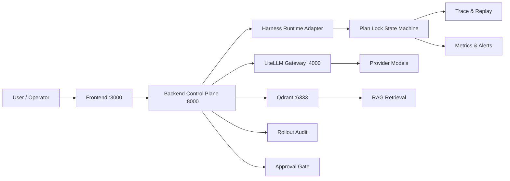
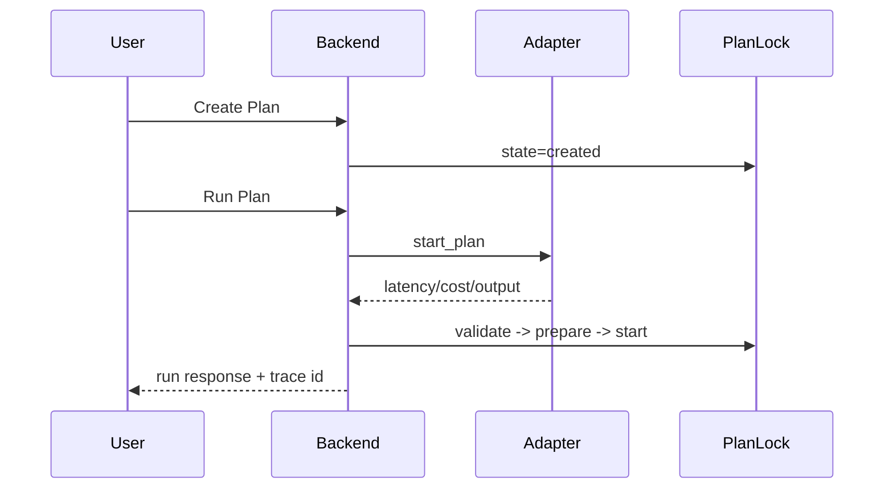
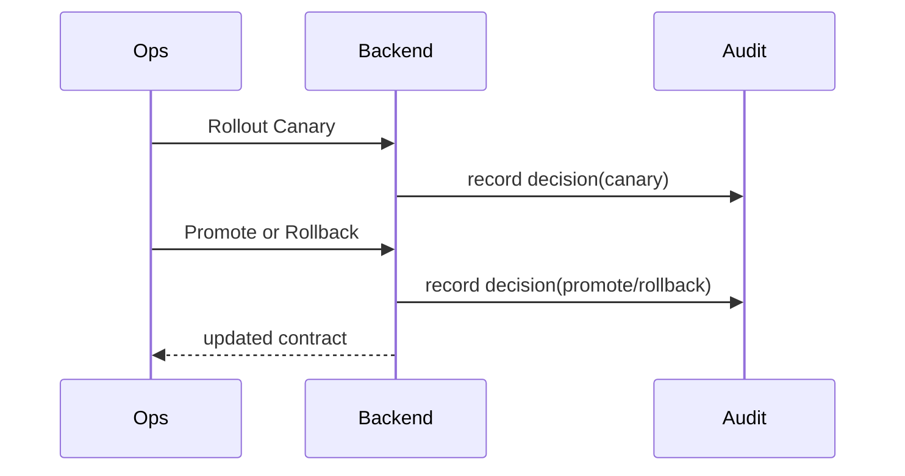

# Team AI Platform 业务架构与技术路线矩阵拓扑（主文档）

更新日期：2026-06-02  
文档定位：业务架构、技术路线、能力矩阵、系统拓扑的一体化主文档。

## 1. 目标

本文件用于统一回答四个问题：
1. 平台服务哪些业务对象与场景。
2. 业务能力如何映射到系统能力。
3. 技术路线如何分阶段落地。
4. 系统组件拓扑和数据流如何组织。

## 2. 业务架构总览

### 2.1 核心业务对象

- Team：组织边界与权限主体
- Project：项目与目标管理主体
- Policy：策略与约束管理主体
- Approval：高风险操作审批主体
- Capability Alias：能力合同与对外稳定接口主体
- Plan/Trace：执行过程与审计追踪主体
- Knowledge Asset：知识资产与RAG素材主体

### 2.2 业务能力域

1. 接入治理域
- 模型网关接入
- 鉴权、配额、限流

2. 执行编排域
- 任务计划、执行、状态机
- 执行器与工具链调度

3. 发布治理域
- canary/promote/demote/rollback
- 审批与变更审计

4. 观测与安全域
- trace、metrics、alerts
- replay 与故障复盘

5. 知识与进化域
- RAG ingest/retrieval
- 策略评估与自动进化

## 3. 业务能力矩阵

| 业务目标 | 核心能力 | 关键接口/脚本 | 验收证据 |
| --- | --- | --- | --- |
| 稳定能力调用 | capability alias 合同化 | /api/v1/harness/capabilities/* | 合同查询与变更审计 |
| 可控执行链路 | plan create/run/event/replay | /api/v1/harness/plans/* | e2e acceptance 报告 |
| 可控发布 | canary/promote/rollback | /api/v1/harness/capabilities/{alias}/rollout-decisions | rollout audit 记录 |
| 可观测运行 | metrics + alerts | /api/v1/harness/metrics, /alerts/evaluate | 指标快照与告警状态 |
| 可回滚止损 | rollback drill | scripts/harness_rollback_drill_run.sh | rollback drill 报告 |
| 可迁移可复制 | runbook 驱动执行 | docs/HARNESS_RUNTIME_MIGRATION_RUNBOOK_2026-06-02.md | runbook + strict validate |

## 4. 技术路线矩阵

| 阶段 | 目标 | 核心实现 | 风险 | 缓解策略 | 退出标准 |
| --- | --- | --- | --- | --- | --- |
| Phase A | 控制面与执行面解耦 | runtime adapter + capability contract | 适配不一致 | 统一 schema 与 conformance test | create/run 链路稳定 |
| Phase B | 发布治理闭环 | rollout service + approval gate + audit | 误发布/误晋级 | canary 小流量 + 自动回滚 | rollback 分钟级生效 |
| Phase C | 观测与安全闭环 | trace/metrics/alerts/replay | 信号噪声或漏报 | 阈值治理 + replay 验证 | 告警与复盘可落地 |
| Phase D | 自动进化闭环 | A/B 策略评估与晋级 | 目标函数偏差 | success/latency/cost/rollback 联合约束 | 至少1条链路自动晋级 |

## 5. 分层技术架构

### 5.1 控制面层（Control Plane）

职责：
- 能力合同管理
- 策略发布治理
- 审批与审计

关键实现：
- `backend/app/routers/harness.py`
- `backend/app/harness/plan_lock.py`

### 5.2 执行面层（Harness Runtime）

职责：
- 执行适配、运行状态推进
- 事件回写

关键实现：
- `backend/app/harness/runtime_adapter.py`
- `backend/app/harness/role_executor.py`

### 5.3 数据面层（Model Gateway + Vector）

职责：
- 统一模型接入、调用治理
- embedding 与向量检索

关键组件：
- LiteLLM
- Qdrant

### 5.4 交互与可视层

职责：
- 控制台与用户交互
- API 文档与观测入口

## 6. 系统拓扑图

## 7. 关键流程拓扑

### 7.1 执行主流程

### 7.2 发布与回滚流程

## 8. 指标矩阵

| 指标 | 解释 | 目标区间 | 告警方向 |
| --- | --- | --- | --- |
| success_rate | 终态成功比例 | 趋高（>= 阈值） | 低于阈值告警 |
| avg_latency_ms | 平均延迟 | 趋低 | 高于阈值告警 |
| total_cost_usd | 累计成本 | 受预算约束 | 超预算告警 |
| rollback_rate | 回滚率 | 低且可解释 | 异常升高告警 |

## 9. 决策边界（LiteLLM vs 自建）

- LiteLLM：网关与模型接入层
- 自建 Control Plane + Harness：业务治理与执行编排层

结论：
- 两者是上下游分层关系，不是替代关系。

## 10. 路线治理与文档规范

1. 本文是业务架构与技术路线唯一主文档。
2. 新增矩阵或拓扑内容必须更新本文，不再拆平行文档。
3. 技术变更同步更新执行计划与用户手册。

## 11. 版本记录

- 2026-06-02 v1.0
  - 初版建立：合并业务域、路线矩阵、拓扑图与指标矩阵。
